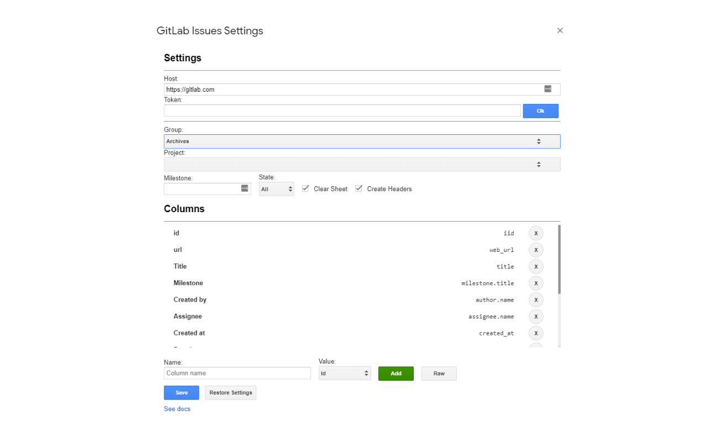

# GitLab Issues Import


This complement allow import your [GitLab](https://about.gitlab.com/) issues to [Google Spreadsheets](https://www.google.com/sheets/about/)

## Settings

First, you need to configure the add-on. In the toolbar go to: `GitLab Issues > Settings`

A dialog will be displayed with the fields to be configured

##### Host:

If you have a self host gitlab instance, change this field.

##### Token:

Your gitlab access token, see [here](https://docs.gitlab.com/ee/user/profile/personal_access_tokens.html) how to create a new token, you need check `read_user` and `api` scopes.

##### Group/Project:

Here, you can specify some project to filter gitlab issues

##### Default Milestone:

The default milestone, once it is configured, it will be filled automatically when you pull the issues

##### Clear Sheet

When check, the sheet will be erased every time you pull the issues

##### Create Headers

When check, the headers will be wrote;



## Columns

The columns have the name and value, the name indicates the header name, and the value indicates the gitlab object value, by default the value field has some values like ID, title, author and assignee, however you can customize the fields using the raw option, in witch you can write a JSON

#### Functions

In the columns it is possible to add a function where the value can be manipulated, the param received in the function is the value of entry in the specified key, see some examples:

```json
[
    {
        name: "id",
        value: "iid",
    },
    {
        name: "Closed at",
        value: "closed_at",
        function: function (closed_at) {
            if (closed_at) {
                var date = new Date(closed_at);
                return date.toLocaleDateString();
            }
            return '';
        }
    },
    {
        name: "Completed",
        value: "time_stats",
        function: function (time) {
            if (time.time_estimate) {
                var rate = (time.total_time_spent / time.time_estimate).toFixed(2);
                return Number.parseFloat(rate) * 100;
            }
            return 0;
        }
    },
]
```


